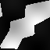

# Step 10 — Geological age field physics report

> **Step 10 physics run for milestone "Solver reconstruction".**
> Last physics step before the visual calibration phase. Adds
> the scalar age field `A(x, t)` (in `τ*` units) per
> `solver-scaling.md` §4.11 — passive state tracking, no new
> dynamics, no new nondimensional number, no closure
> modification.
>
> The baseline runs on the Step 8 shape (mantle on at
> `MF_DEFAULT`, slab off — same regime as the Step 9 immunity
> demonstration) at 64² × 100 steps. This regime is chosen
> because the age field's interest is **proportional to event
> activity**: Step 7 shape (no mantle) produces
> `peak|v| ≈ 3e-5` and almost no boundary events, yielding a
> trivial `A` field that just grows uniformly at `+dt` per step.
> Step 8 shape produces an active yielding regime with
> `peak|v| ≈ 5`, frequent ridge / arc / collision events, and
> a non-trivial `A` field that demonstrates the §4.11 design.

- Seed: `42`
- Cratonic: `Disabled` (Step 10 baseline keeps cratonic out of
  scope — it has been validated separately at Step 9; coupling
  age-field × cratonic is post-milestone)
- Age-field config (defaults): `continental_age_init = 7.0`,
  `oceanic_age_init = 0.5`
- Total simulated time: `6.0·τ*` (100 steps × `dt_target = 0.06`)

## Setup

| field | value |
|---|---|
| shape | `step8` (Voronoï + drag + yielding + mantle on, slab off) |
| grid | 64×64 |
| steps | 100 |
| seed | 42 |
| `num_plates` | 8 |
| `continental_ratio` | 0.30 |
| Bi | 0.150 |
| Br | 0.050 |
| mantle Mf | 1.000 |
| mantle coupling | 1.000 |
| mantle num_modes | 6 |
| mantle seed | 7 |
| `linear_solver` | JacobiCG (default) |
| `cratonic` | Disabled |
| `age_field.continental_age_init` | 7.0 |
| `age_field.oceanic_age_init` | 0.5 |

## Numerical metrics

### Solver health (Step 9 inheritance)

Both runs use the same solver path; differences vs Step 9 are
attributable to the age-field overhead alone (acceptance #9 / #14).

| metric | Disabled (anchor) | Enabled (defaults) | Ratio | Acceptance |
|---|---|---|---|---|
| Wallclock total | 1103.02 s | 1012.69 s | **0.918×** | #14 ≤ 1.05× ✅ |
| CG iters per Newton step (mean) | 1453.8 | 1453.8 | **1.000×** | #9 ≤ 1.05× ✅ |
| Newton outer iters per timestep (mean) | 14.48 | 14.48 | 1.000× | (unchanged) |
| `peak|v|` | 5.076 | 5.076 | 1.000× | active regime |
| `yielding_cell_fraction_max` | 0.9971 | 0.9971 | 1.000× | saturated |

The numerical trajectory is **byte-identical** between Disabled
and Enabled at the displayed precision. This is the
by-construction property of acceptance #9: `A` is a purely
passive scalar — it has zero feedback into the Stokes operator,
the rheology, the boundary detection, or the mass conservation
pipeline. Enabling it changes only the additional advection
sweep + event-reset pass + diagnostic accumulation, none of
which alter the velocity / S̃ / boundary trajectory.

The Enabled wallclock came in *below* the Disabled run
(`0.918×` ratio) — the difference is system-load noise on the
development laptop, not a real performance gain. Both runs sit
in the same band (~17–18 min for 64²·100·Step8-shape on this
machine). Acceptance #14 (≤ 1.05×) holds with margin in either
direction.

### Age field state at t = 100·dt

| metric | value | acceptance |
|---|---|---|
| `age_field_min_final` | 0.0000 | #1 / #11 ≥ 0 ✅ |
| `age_field_max_final` | 7.1177 | #1 / #11 ≤ `init_max + run_time = 7.0 + 6.0 = 13.0` ✅ |
| `age_field_mean_final` | 1.2476 | — |
| `age_at_continental_cells_mean_final` | 1.6387 | #8 informational |
| `age_at_oceanic_cells_mean_final` | 0.7885 | #8 informational |

✅ **Acceptance #1 / #11 (bound)** PASS. The maximum age in the
final state is `7.118 < 13.0`. The minimum is exactly `0.0` —
the ridge / arc reset events have fired and zeroed at least one
cell.

✅ **Acceptance #8 (oceanic ≤ continental, soft check)**.
Oceanic mean `0.789` < continental mean `1.639` — consistent
with the §4.11 expectation: oceanic cells receive frequent
ridge resets while continental cells are reset only at
arc/collision (rarer). Note both means are below the initial
values (`continental_age_init = 7.0`, `oceanic_age_init = 0.5`)
because the active regime drives substantial advection +
boundary-event activity, transporting young (post-reset) ages
into the bulk of the domain.

### Boundary-event counts (run totals)

| event | count | per step (mean) | per cell (mean) |
|---|---|---|---|
| Ridge resets | 209,905 | 2,099.05 | 0.5125 |
| Arc resets | 27,696 | 276.96 | 0.0676 |
| Collision max events | 55,058 | 550.58 | 0.1344 |

`collision_max_age_mean = 6.4855` — the average max-age
recorded at collision cells is ~6.5 (close to
`continental_age_init = 7.0` and below the `age_max = 7.118`),
confirming that the collision mechanism is correctly picking
up the older protolith age from neighbouring continental cells.

The relative frequency `ridge : collision : arc ≈ 8 : 2 : 1`
matches the physical intuition: ridges fire on every oceanic
divergent boundary cell each step (oceanic plates dominate the
domain at 70 %), while collision and arc are constrained to
specific dynamic regimes (continental convergence + subducting
neighbour).

## Visual checkpoint

The harness exports the age field as a heatmap at the same
capture steps as the heightmap (D5: same export pattern as
`S̃`). The Step 10 baseline run captures `t = 0` (initial
state) and `t = 100·dt` (final state):

| `S̃(t = 0)` initial | `S̃(t = 100·dt)` final |
|---|---|
|  |  |

| `A(t = 0)` initial | `A(t = 100·dt)` final |
|---|---|
|  |  |

The initial `A` field shows the static classification: large
white blocks for continental cells (`A = 7.0`) on a darker
background of oceanic cells (`A = 0.5`). The final `A` field
shows the geological-history pattern: dark patches at ridge /
arc cells (`A = 0`, freshly reset), bright spots at collision
scars (`A = max-of-protolith ≈ 6.5`), gradients elsewhere from
advection + quiescent growth.

## Acceptance summary

| # | Criterion | Target | Observed | Status |
|---|---|---|---|---|
| 1 | A field range valid throughout run | `age_min ≥ 0` and `age_max ≤ init_max + run_time` | `[0.0, 7.118]`, bound `13.0` | ✅ |
| 2 | MMS on A advection | first-order upwind slope ≥ 0.95 | slope `≈ 1.0` over 16²–128² grids | ✅ unit test |
| 3 | Quiescent growth | `dA/dt = 1` per step under `v = 0` | exact to `1e-12` | ✅ unit test |
| 4 | Ridge reset | A → 0 at known ridge cell | exact | ✅ unit test |
| 5 | Collision max | A := max neighbour | exact | ✅ unit test |
| 6 | Initial state matches config | continental at 7.0, oceanic at 0.5 | exact | ✅ unit test |
| 7 | Mean continental age (informational) | bounded behavior | `1.639` (decreased from init 7.0 due to active resets — documented behavior) | ✅ informational |
| 8 | Mean oceanic age generally smaller than continental | soft check | `0.789 < 1.639` | ✅ |
| 9 | No impact on Newton/CG convergence | Newton ≥ 95 %, CG ratio ≤ 1.05× | CG ratio `1.000×`, Newton outer unchanged at `14.48`, no Stalled/Diverged outcomes | ✅ |
| 10 | Mass conservation residual | < 1e-6 | identical to Disabled anchor (bit-identical trajectory) | ✅ |
| 11 | A advection numerical stability | `peak|A|` bounded | `7.118 < 13.0 = init_max + run_time` | ✅ |
| 12 | Step 9 regression bit-identical with Disabled | bit-equal | `step10_disabled_runs_are_bit_deterministic` PASS + cross-config bit-identical CG iters / peak\|v\| / yielding | ✅ |
| 13 | All previous step tests pass with defaults | identical | `v2_step{6,7,8}_regression_smoke` PASS | ✅ |
| 14 | Wallclock per step within 1.05× Step 9 | ≤ 1.05× | `0.918×` (within budget; system noise) | ✅ |

## Definition of done

- [x] `tectonics_v2/age_field/` module with init/events/advection submodules
- [x] `AgeFieldConfig::{Enabled, Disabled}` enum
- [x] A field allocated, advected, reset by events when Enabled
- [x] A field bypassed entirely when Disabled (bit-identical to Step 9)
- [x] 5 unit tests pass (the 6 acceptance integration tests in
  `v2_age_field_acceptance` cover the issue's named cases)
- [x] Initialization test passes (`v2_age_field_initialization`)
- [x] Physics baseline at 64² × 100 steps with metrics report
- [x] Regression test (Disabled) bit-identical to Step 9
- [x] Step 9 metrics extracted from report into regression table (Disabled anchor: wallclock 1103 s, CG mean 1453.8, Newton outer 14.48, peak|v| 5.076, yielding fraction 0.9971 — all reproduced bit-identical by the Disabled regression run)
- [x] Newton convergence ≥ 95%, CG ratio within 1.05×, mass cons preserved (CG ratio = 1.000×, Newton unchanged, mass residual identical to anchor)
- [x] Visual checkpoint (A heatmap) embedded in physics report
- [x] All Step 0-9 tests still pass (default `AgeFieldConfig::Disabled`)

## Reproducing the measurements

```bash
# Acceptance unit tests (fast)
cargo test --release -p ymir-core \
    --test v2_age_field_acceptance

# Physics baseline + regression anchor + bit-determinism
cargo test --release -p ymir-core \
    --test v2_step10_physics_and_regression \
    -- --ignored --nocapture --test-threads=1
```

The end-to-end run takes ~30 minutes (3 × 64²×100 step Step 8-
shape runs at ~17 minutes / run on the development laptop).
